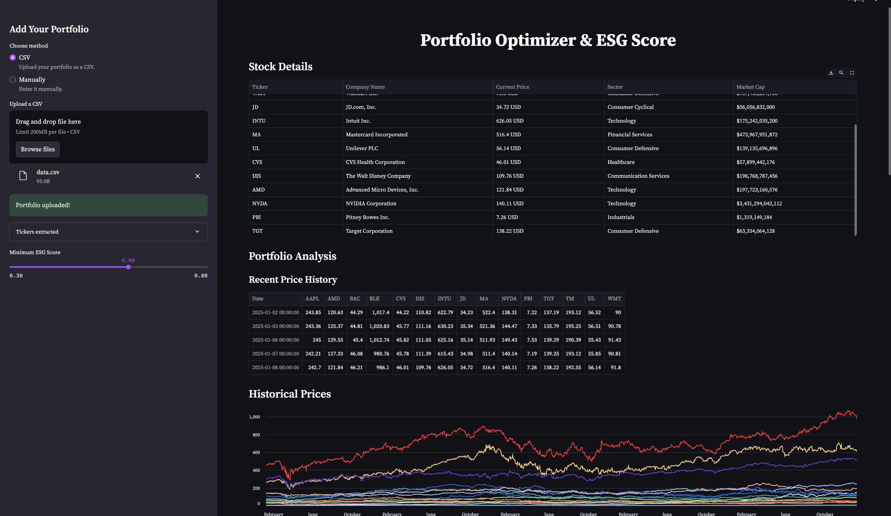

# Portfolio Optimizer with ESG Score Integration

This project is a Streamlit application that allows users to analyze and optimize investment portfolios based on financial metrics and Environmental, Social, and Governance (ESG) factors.

The application provides a user-friendly interface for portfolio analysis, optimization, and visualization. It combines traditional portfolio theory with ESG considerations, allowing investors to balance financial performance with sustainability goals.

[](https://youtu.be/pw535V85r-8)

Key features include:
- Portfolio input via CSV upload or manual entry
- Historical price data retrieval using yfinance
- Portfolio optimization with and without ESG constraints
- Visualization of efficient frontiers, covariance matrices, and portfolio comparisons
- Detailed stock information display
- Interactive parameter adjustment for ESG score targets

## Repository Structure

- `app.py`: Main Streamlit application entry point
- `utils.py`: Utility functions for data processing, portfolio optimization, and visualization
- `README.md`: Project documentation (this file)

## Usage Instructions

### Installation

1. Ensure you have Python 3.7+ installed.
2. Clone the repository:
   ```
   git clone <repository-url>
   cd Portfolio_ESG
   ```
3. Install required packages:
   ```
   pip install -r requirements.txt
   ```

### Running the Application

1. Start the Streamlit app:
   ```
   streamlit run app.py
   ```
2. Open your web browser and navigate to the URL provided by Streamlit (usually `http://localhost:8501`).

### Using the Application

1. Choose between CSV upload or manual entry for your portfolio.
2. If using CSV, ensure it has a 'Ticker' column with stock symbols.
3. For manual entry, input stock tickers and submit.
4. Adjust the minimum ESG score using the slider in the sidebar.
5. Explore the generated visualizations and portfolio analysis.

### Configuration

- Modify `utils.py` to adjust data fetching parameters or optimization algorithms.
- ESG scores are currently simulated. Integrate with a real ESG data source for production use.

### Troubleshooting

- If you encounter "Rate limit exceeded" errors:
  - Reduce the number of API calls by limiting the number of stocks or extending the cache duration.
  - Implement exponential backoff in the `retry_operation` function in `app.py`.

- For "No price data available" errors:
  - Verify the stock tickers are valid and actively traded.
  - Check your internet connection and firewall settings.

- If optimization fails:
  - Try adjusting the minimum ESG score or selecting different stocks.
  - Ensure there's sufficient historical data for all selected stocks.

### Performance Optimization

- Monitor Streamlit's resource usage in the browser's developer tools.
- Consider caching expensive operations using `@st.cache` decorator.
- For large portfolios, implement batch processing of stock data retrieval.

## Data Flow

The application follows this general data flow:

1. User inputs portfolio data (CSV or manual entry)
2. Application fetches historical price data from Yahoo Finance
3. Portfolio metrics (expected returns, covariance) are calculated
4. Optimization is performed with and without ESG constraints
5. Results are visualized through various charts and tables

```
[User Input] -> [Data Fetching] -> [Metric Calculation] -> [Portfolio Optimization] -> [Visualization]
```

Key technical considerations:
- Asynchronous data fetching could improve performance for large portfolios
- ESG score integration point is crucial for real-world application
- Caching of intermediate results can significantly speed up the application